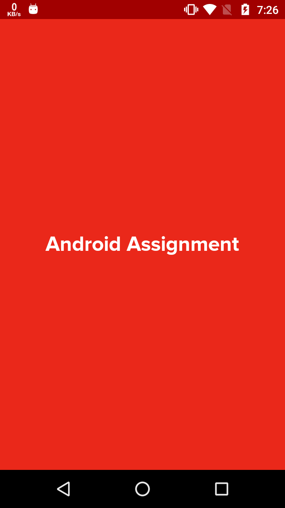
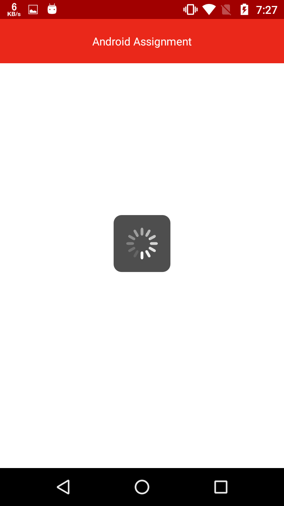
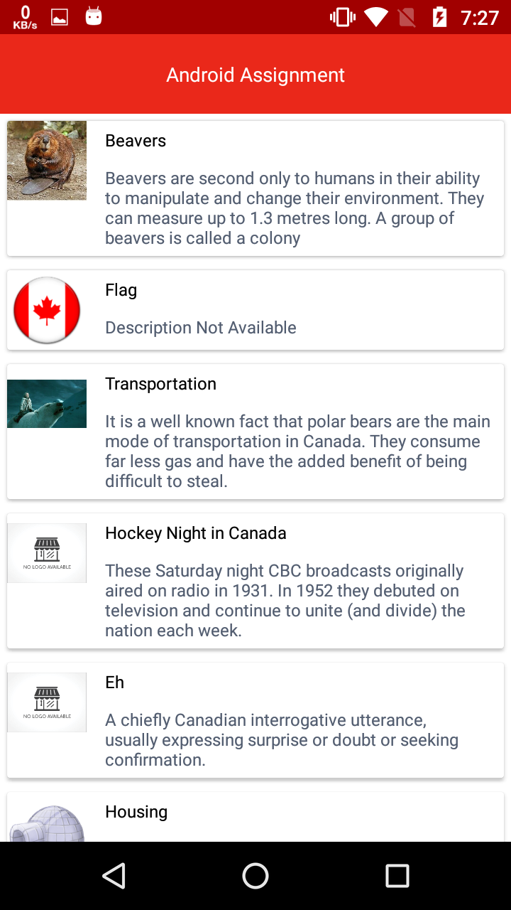
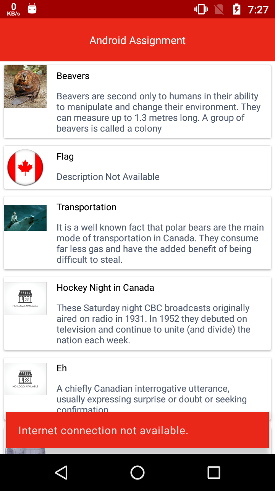

Android Assignment Test

<h2 style="text-align: left;"><strong>Android Project Screen</strong></h2>

<strong><em>Step 1:</em></strong>Splash Screen

<em><strong>Step 2: </strong></em>Loading data from server.

 

<em><strong>Step 3: </strong></em>Data added in DB and load from DB and display in list.

 

<em><strong>Step 4: </strong></em>Internet connection not available message. Load data from DB and display.

 

<h2><strong>What is in Android Project?</strong></h2>
<ol>
<li>MVVM architectures setup files.</li>
<li>Added SplashScreen, HomeScreen and HomeFragmentScreen and of their 3 ViewModel Class.</li>
<li>Added Database in asset folder and database classes.</li>
<li>Added required drawable asset and other files.</li>
</ol>

<h2><strong>Project has blow Activity and Utility Classes</strong></h2>
<ol>
<li>BaseActivity has dagger2 activity and fragment inject method. It has database create and helper method.</li>
<li>Splash Screen has 4 second timeout to open MainActivity.</li>
<li>MainActivity has create database method.</li>
<li>HomeFragment and HomeViewModel has load data from api and set data db and display data in list methods.</li>
<li>CommonDataUtility class has loadImage, checkConnection and showSnackBar methods.</li>
<li>StaticDataUtility class has SERVER_URL, APP_TAG ec variables.</li>
</ol>

Data package has API and Model Class.

<ol>
<li>API package has api related class.</li>
<li>Model package has response and local model class.</li>
</ol>

So that's all for this Project. If any query/suggestion for Firebase Cloud Messaging Tutorial ask freely on
hardikdungrani8@gmail.com

Thanks.